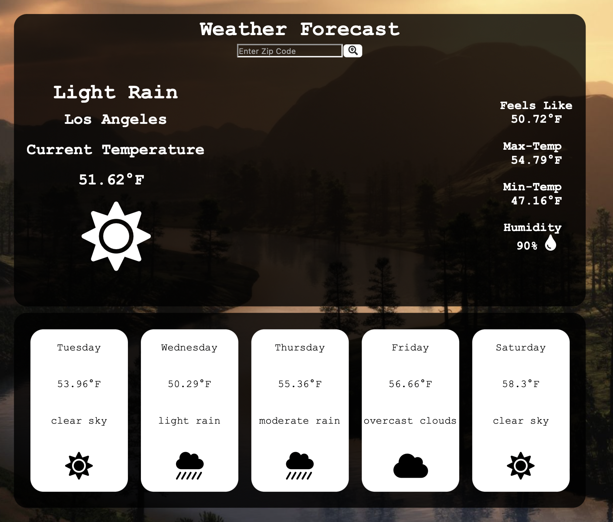

# Weather-App-React

View daily and weekly weather forecasts using Zip-Codes and have information displayed dynamically using API calls!

- Display current forecast and temperature max and mins.
- Display five day forecast with temperature and weather conditions.
- Unique weather symbols and icons for each forecast condition.
- Multiple API calls to retrieve required data.



### Live Demo

[GitHub Pages](https://rcamach7.github.io/weather-app-react/).

### Built Using:

- [OpenWeatherApp API](https://openweathermap.org)
- React Framework
  - lifecycle methods
  - class components
  - functional components
  - state management
  - event handlers
  - fetch API calls
- Javascript
- [FontAwesome Toolkit](https://fontawesome.com)
- HTML
- CSS

#### Local Installation & Running

```bash
git clone https://github.com/rcamach7/weather-app-react.git
cd weather-app-react
npm install
npm run start
```
